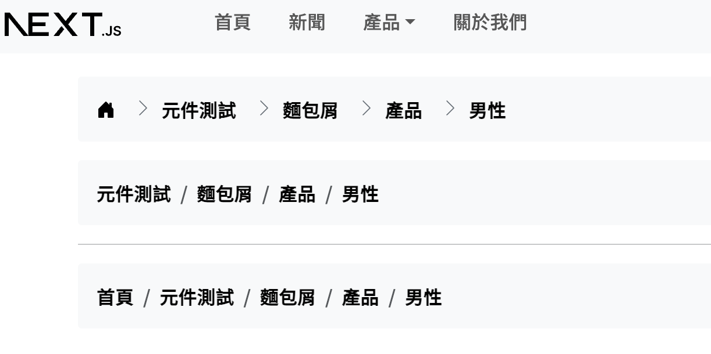

# next-bs5

next.js + bootstrap5 boilerplates

## TODO

- [ ] admin(dashboard) sidebar page layout
- [ ] separate product list, detail, cart components

---

- [X] connent with useCart hook
- [X] landing page layout
- [X] user pages (register/ login / forget-password)
- [X] product pages (list, detail)
- [X] shopping cart pages
- [X] breadcrumb
- [X] menu active css auto apply
- [X] megamenu sample component

## FIXME

- NextBreadCrumb has flush bug

## Demo

### breadcrumb

---

## ChangeLog

> `^`: change/update `+`: add `-`: remove `!`: notice

### 230624

- +react-icons
- -remove fontawesome icons npm module

### 230622

- ^next-breadcrumb use router.isReady to check if dynamic route path is ready
- +next-breadcrumb add bgClass prop for custom bg css class
- ^dropdown menu change expand behavor from click to hover
- ^tune apply all active menu css class(custom class)
- +menuitem hover slide in animation

### 230618

- ^next-breadcrumb +home icon and with chevron divider style(refs: [bs5 official example](https://getbootstrap.com/docs/5.3/examples/breadcrumbs/))

### 230617

- +chinese font family globally
- ^replace react-bootstrap navbar to pure bs5 navbar
- +breadcrumb with useRouter

### 230616

- +fontawesome icons
- +bootstrap icons
- ^[bugs] change `400.js` to `404.js`